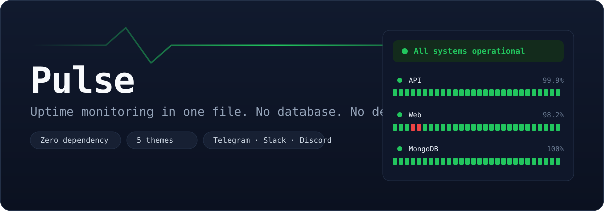

<p align="center">
  
</p>

<p align="center">
  <b>English</b> · <a href="README.vi.md">Tiếng Việt</a>
</p>

<p align="center">
  <a href="https://github.com/nguyenquocanhz/pulse/actions/workflows/test.yml"></a>
  
  = 20">
  
</p>

# Pulse

**Uptime monitoring in one file. No database. No dependencies.**

Check your services, serve a status page, and alert on failures — all in a single plain Node process. `git clone` and run, nothing to install.

```bash
git clone https://github.com/<you>/pulse.git && cd pulse
cp monitors.example.json monitors.json
npm start
```

Open `http://localhost:3001`.

- **Zero dependency** — core Node only, no `npm install`
- **No database** — history is NDJSON, self-trimming
- **5 themes** — Slate, Midnight (OLED), Terminal, Nord, Light
- **2 languages** — English and Vietnamese, switch in the UI
- **Alerts** — Telegram, Slack, Discord, Zalo, Messenger; only on state change
- **`/healthz`** — so an external service can watch Pulse itself

The whole codebase reads in ten minutes.

---

## Inside

- No framework — the status page is one static HTML file; theme and language persist to localStorage
- Storage is one NDJSON file per monitor, no external service
- Run with `node src/cli.js`, or drop into Docker/systemd

---

## Configuration

Everything lives in one JSON file. See `monitors.example.json` for a full example, and [`examples/recipes.md`](examples/recipes.md) for ready-made configs per service.

### Monitor

```json
{
  "id": "api",
  "name": "API",
  "type": "http",
  "url": "http://192.168.1.50:6001/health",
  "interval": 30,
  "retries": 2,
  "keyword": "ok",
  "expectStatus": [200]
}
```

| Field | Meaning |
|---|---|
| `id` | Required, unique. Used as the storage key. |
| `type` | `http` (default) or `tcp` |
| `url` | For HTTP |
| `host` + `port` | For TCP (databases, SSH…) |
| `interval` | Seconds between checks (default 60) |
| `retries` | Attempts before declaring down (default 1) |
| `keyword` | String that must appear in the body. **Catches the case where a server returns 200 but the content is broken** — something a status-code check misses entirely. |
| `expectStatus` | HTTP codes treated as success (default 2xx–3xx) |
| `insecure` | `true` to accept self-signed certificates |

### Alert channels

Alerts fire **only on state change** — exactly twice: when it goes down, and when it recovers. No spam every cycle.

```json
"notifications": [
  { "type": "telegram", "token": "...", "chatId": "..." },
  { "type": "slack",    "url": "https://hooks.slack.com/services/..." },
  { "type": "discord",  "url": "https://discord.com/api/webhooks/..." }
]
```

| Channel | Needs |
|---|---|
| `telegram` | Bot token + chat id |
| `slack` | Incoming Webhook URL |
| `discord` | Webhook URL |
| `zalo` | OA access token + user id |
| `messenger` | Page access token + PSID |
| `webhook` | Any URL, receives the full state as JSON |

---

## ⚠️ A note on Messenger and Zalo

Pulse sends Messenger and Zalo through their **official APIs**: the Facebook Send API (Page + access token) and the Zalo Official Account API (OA + access token).

**Think twice before sending via a personal-account cookie.** Some libraries send Messenger/Zalo messages by borrowing your login cookie — Pulse deliberately does not, and you should be cautious if you build it yourself:

- **Against the terms of service.** Both platforms forbid automating personal accounts. The account — including your main one — can be banned.
- **Very brittle.** Cookies expire constantly and internal endpoints change often. A monitoring tool that keeps dying is worse than none.
- **Security risk.** A login cookie is as good as your password. Putting it in a config file or repo exposes the whole account.

If you still want it for your own account, do so at your own risk, keep the cookie out of the repo, and don't use your primary account. The safe path is a dedicated Bot/OA via the official API.

---

## Endpoints

| Path | Returns |
|---|---|
| `/` | Status page, refreshes every 10s |
| `/api/status` | Full state as JSON (CORS open, embeddable) |
| `/healthz` | `200` when all is well, `503` when any service is down |

`/healthz` is how you **watch Pulse itself from outside**. A free external uptime service (healthchecks.io, UptimeRobot…) only needs to watch this one URL to know about the whole system — and, more importantly, to know when the **Pulse host itself dies**, which Pulse cannot report on its own.

---

## Running as a service

### systemd

```ini
[Unit]
Description=Pulse
After=network.target

[Service]
WorkingDirectory=/opt/pulse
ExecStart=/usr/bin/node src/cli.js
Restart=always

[Install]
WantedBy=multi-user.target
```

### Docker

Pull the published image:

```bash
docker run -d -p 3001:3001 \
  -v $PWD/monitors.json:/app/monitors.json:ro \
  -v pulse-data:/app/data \
  ghcr.io/nguyenquocanhz/pulse:latest
```

Or with compose:

```bash
docker compose up -d
```

The image is built and published by GitHub Actions on every version tag. No `npm install` because there is nothing to install.

---

## Environment

| Variable | Default |
|---|---|
| `PULSE_PORT` | 3001 |
| `PULSE_DATA` | `./data` |

---

## Tests

```bash
npm test
```

13 tests, no network needed: checker (against a real ephemeral server), storage, status classification, and the alert-only-on-change logic.

---

## Limits — know these upfront

- A monitor's history is loaded into memory on read. Default is 2000 points/monitor (~a few hundred KB). If you need millions of points, this isn't the tool.
- Cache and alert state live in-process. Run several Pulse instances and each has its own state.
- Checks run in-process. Fine up to a few dozen monitors; for hundreds, use something else.

Pulse is intentionally small. If you need more, [Uptime Kuma](https://github.com/louislam/uptime-kuma) is a great choice.

---

## License

MIT
